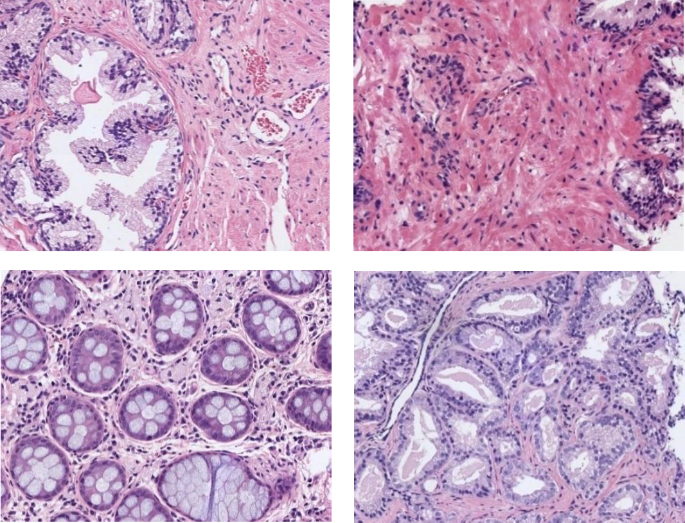
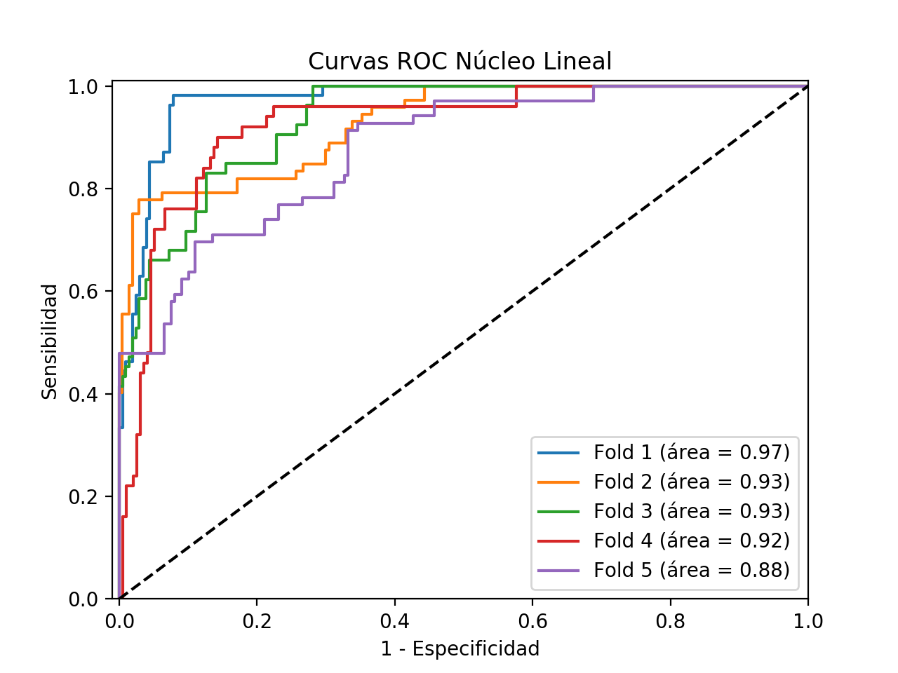
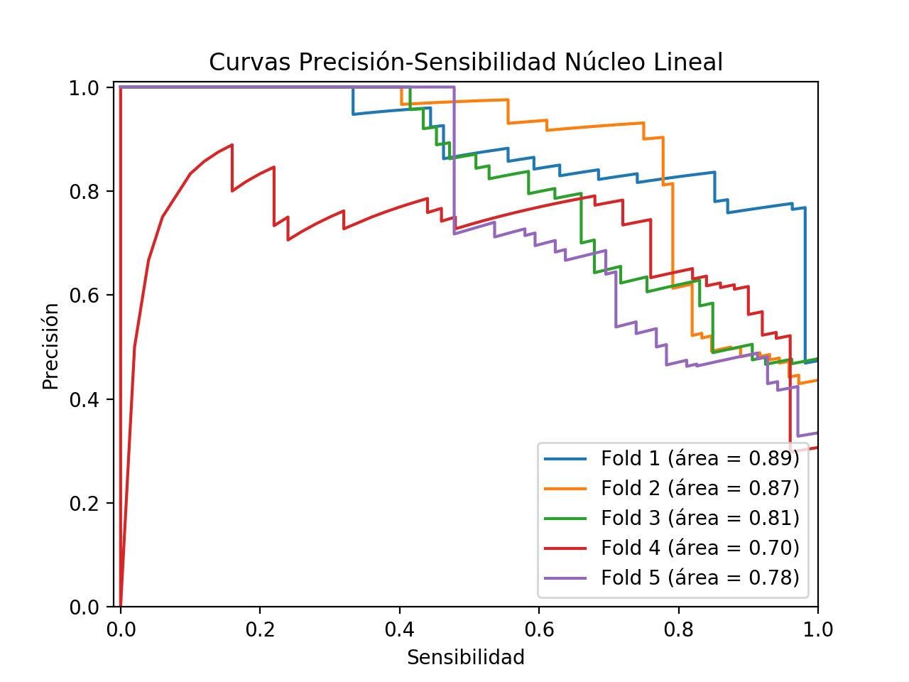
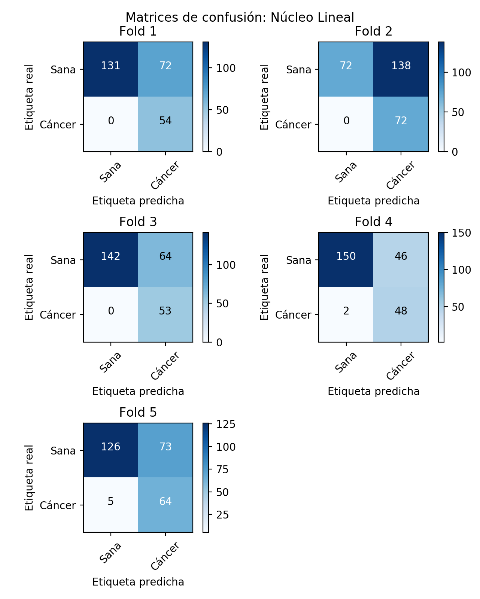
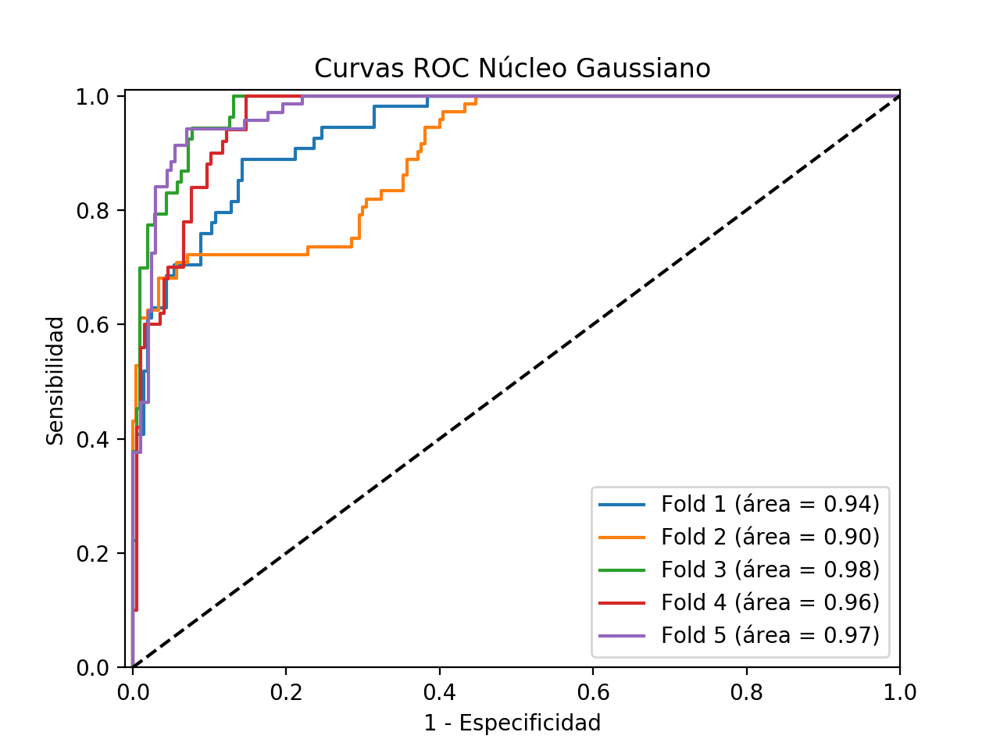
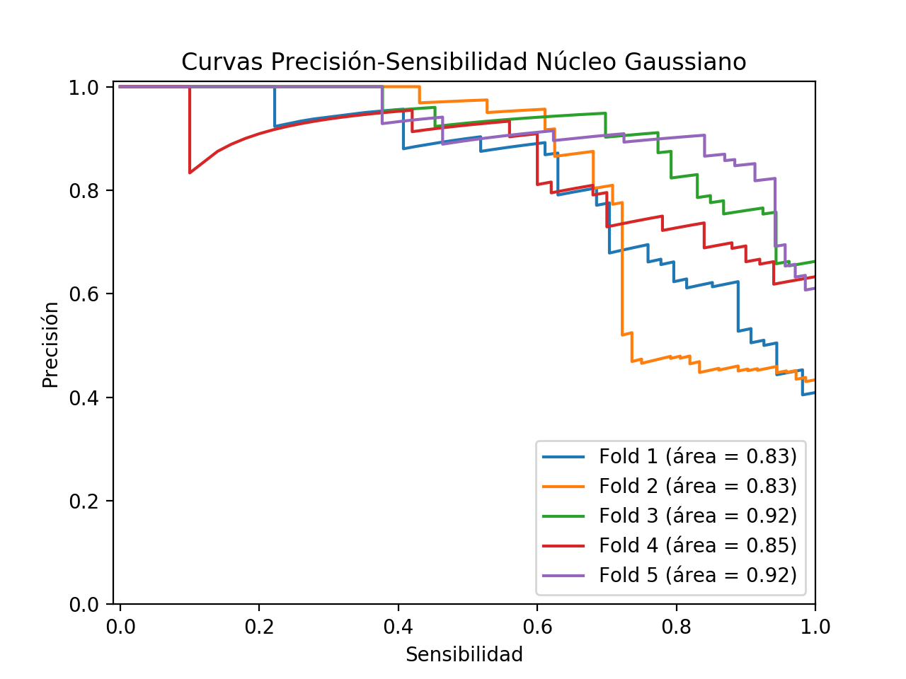
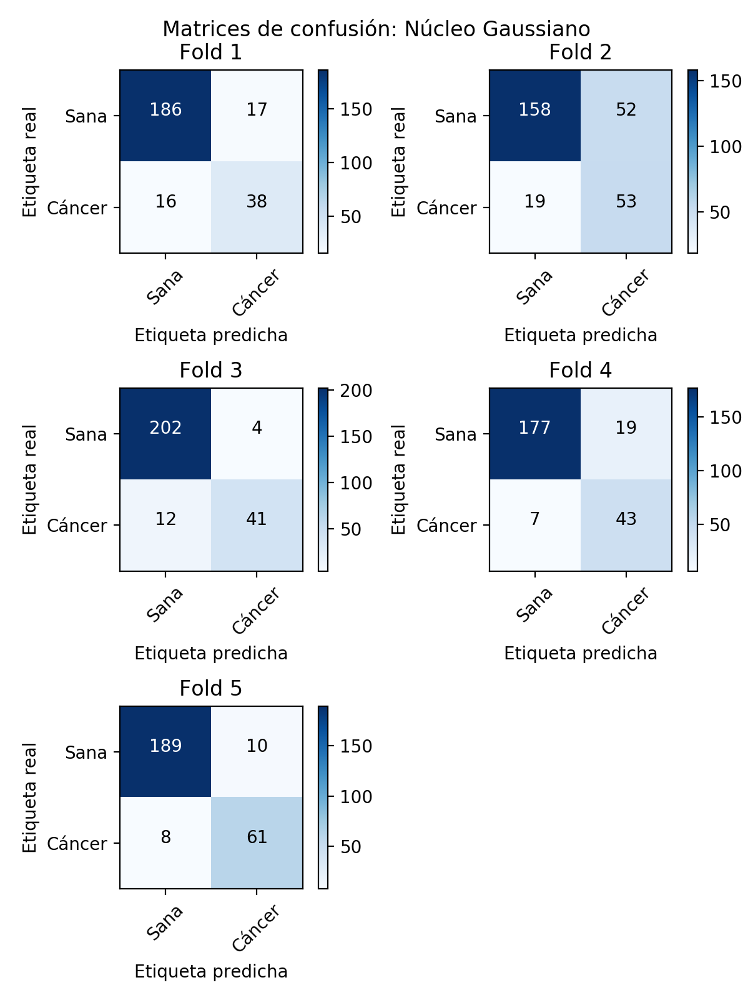

# Detección de cancer en imágenes histológicas de próstata
Este informe se corresponde con el documento resultante tras la práctica de procesos gaussianos para la **clasificación de imágenes histológicas de próstata, de acuerdo a la existencia o no de cáncer**. Esta práctica se enmarca en el *Tema 9: Modelos para regresión*, de la asignatura *Extracción en características en Imágenes*, del master de Ciencia de Datos e Ingeniería de Computadores (DATCOM), de la Universidad de Granada.

**Imágenes de tejido sano (panel superior) y de tejido cancerígeno (panel inferior)**

Concretamente, para esta práctica se provee de un conjunto de datos de 1014 imágenes provenientes de tejido sano y 298 de tejido cancerígeno, de las cuales han sido extraídos 10 descriptores. En este conjunto de datos ya vienen predeterminados los folds a utilizar en la validación cruzada, de forma que los datos se encuentran en una primera instancia divididos de acuerdo a su clase y posteriormente cada una de ellas en 5 conjuntos de similar tamaño, cada uno representativo de un *fold* de la validación cruzada.

Para llevar a cabo la clasificación de los datos de las imágenes, se utilizará el algoritmo de procesos gaussianos, que cuyo funcionamiento será definido en este informe, previamente a la presentación de los resultados obtenidos mediante este en el conjunto de datos. Así, uno de los principales retos del problema que aquí se presenta, es la necesidad de lograr la mejor clasificación prosible mediante este algoritmo, sobre un conjunto de datos que se encuentra altamente desbalanceado. Por ello y para cada uno de los *folds* de la clase mayoritaria (clase negativa) de la validación cruzada a realizar, tomaremos la totalidad de datos de la clase positiva a fin de balancear las observaciones de cada clase en los modelos a entrenar. 

- [Detección de cancer en imágenes histológicas de próstata](#detección-de-cancer-en-imágenes-histológicas-de-próstata)
  * [¿Qué es un proceso gaussiano?](#qué-es-un-proceso-gaussiano)
  * [Software utilizado para la realización de la práctica](#software-utilizado-para-la-realización-de-la-práctica)
  * [Resultados experimentales](#resultados-experimentales)
    + [Kernel Lineal](#kernel-lineal)
      - [Curva ROC y curva precisión-sensibilidad](#curva-roc-y-curva-precisión-sensibilidad)
      - [Matrices de confusión](#matrices-de-confusión)
      - [Métricas por fold](#métricas-por-fold)
      - [Comentario de los resultados para kernel lineal](#comentario-de-los-resultados-para-kernel-lineal)
    + [Kernel Gaussiano](#kernel-gaussiano)
    + [Curva ROC y curva precisión-sensibilidad](#curva-roc-y-curva-precisión-sensibilidad-1)
      - [Matrices de confusión](#matrices-de-confusión-1)
      - [Métricas por fold](#métricas-por-fold-1)
      - [Comentario de los resultados para el kernel gaussiano](#comentario-de-los-resultados-para-el-kernel-gaussiano)
  * [¿Cómo se clasificaría un nuevo dato?](#cómo-se-clasificaría-un-nuevo-dato)
  * [Diseño de experimento adicional](#diseño-de-experimento-adicional)

## ¿Qué es un proceso gaussiano?
Un proceso gaussiano consiste en una colección (potencialmente infinita) de variables aleatorias, cada una de las
cuales sigue una distribución normal, para las que dado cualquier subconjunto finito de las mismas, este sigue una distribución normal multivariante. 

$f(x) ∼ GP(m(x), k(x,x'))$

Esta notación significa que para cada valor $x ∈ R^n$, consideramos la función $f(x)$ como una variable aleatoria, es decir, se define una distribución sobre el conjunto de funciones reales, siendo la función de media:

$m(x) := E[f(x)]$ 

y la función de covarianza:

$k(x, x') := E[(f(x) − m(x))(f(x') − m(x'))]$

Intuitivamente esto significa que el valor de $f(x)$ se trata como una variable aleatoria con media $m(x)$ y con covarianza entre pares de variables aleatorias.

De este modo, un proceso gaussiano define una distribución previa, que puede ser convertida en una distribución posterior una vez que hayamos visto algunos datos. Aunque pueda parecer difícil representar una distribución sobre una función, resulta que sólo necesitamos ser capaces de definirla sobre los valores de la función en un conjunto de puntos finitos, pero arbitrarios, por ejemplo $x_{1},…,x_{N}$. Un proceso gaussiano asume que $p(f(x_{1}),…,f(x_{N}))$ sigue de forma conjunta una gaussiana, con media $μ(x)$ y covarianza $∑(x)$ dada por $∑_{i,j}=k(x_{i},x_{j})$, donde $k$ es una función de kernel. La idea clave es que si $x_{i}$ y $x_{j}$ el kernel considera que son similares, entonces esperamos que la salida de la función en esos puntos sea similar también.

Así como para la $μ(x)$ podemos usar cualquier función real, para $k(x_{i},x_{j})$ debe de cumplirse que para cualquier conjunto de elementos, la matriz resultante sea valida para una distribución gaussiana multivariable (semidefinitiva positiva), lo cual son las mismas condiciones que para los *kernels*, por lo que cualquier función kernel se puede usar como función de covarianza.

## Software utilizado para la realización de la práctica
Para realizar la presente práctica, se ha hecho uso del lenguaje de programación *Python*, en su versión 3.7. Del mismo modo, el entorno de desarrollo que se ha utilizado es *Pycharm*, de la empresa de software JetBrains. Entre los distintos paquetes de Python en los que se implementa el algoritmo de procesos gaussianos, en nuestro caso utilizaremos **GPflow**. GPflow es un paquete para la construcción de modelos de procesos gaussianos en python, utilizando TensorFlow para ejecutar los cálculos, lo que permite una ejecución más rápida que el resto de paquetes, pues puede hacer uso de GPU.

Para implementar los modelos utilizados en esta práctica, se ha utilizado el objeto **VGP**, presente en el paquete *models*. Esta implementación del Proceso Gaussiano Variacional (VGP) aproxima la distribución posterior a una gaussiana multivariada. Sobre estos modelos VGP, hemos definido la distribución de probabilidad que utilizaremos. En nuestro caso, al tratarse de un problema de clasificación binaria, haremos uso de una distribución de Bernouilli. Por último y de acuerdo a los requisitos formales establecidos para la realización de este trabajo, se hacen uso de dos tipos de kernel distintos para el proceso gaussiano: uno lineal (Linear) y otro gaussiano (RBF), ambos dentro del paquete *kernels*. Para ambos *kernels* se ha modificado el tamaño de la variable *input_dim* para establecerla al número de variables a considerar de nuestro conjunto de datos.

Además, el resto de paquetes de software que se han utilizado para la implementación de esta práctica han sido:

* **matplotlib**: Para llevar a cabo las visualizaciones de los gráficos a mostrar en los resultados (Curvas ROC, matrices de confusión...).
* **sklearn**: Tanto para llevar a cabo tareas de preprocesamiento sobre los datos, como para realizar el cálculo de métricas para evaluar la clasificación efectuada por los modelos generados.
* **numpy**: Para efectuar cálculos sobre matrices de forma más sencilla y eficiente.

## Resultados experimentales
A continuación, se muestran los resultados obtenidos para la validación cruzada de modelos de procesos gaussianos, en primer lugar con el kernel lineal y posteriormente con el gaussiano.

### Kernel Lineal
Una vez realizada la validación cruzada sobre el conjunto de datos, haciendo uso de procesos gaussianos con kernel lineal, hemos obtenido una serie de métricas, que a continuación se exponen.

#### Curva ROC y curva precisión-sensibilidad
Se presenta tanto las curvas ROC obtenidas para cada uno de los modelos generados en los distintas divisiones de los datos en la validación cruzada, como las curvas de precisión y sensibilidad.

Curvas ROC                     |  Curvas Precisión/Sensibilidad
:-----------------------------:|:----------------------------------:
  |  

#### Matrices de confusión
Del mismo modo, a continuación se exponen las matrices de confusión correspondientes a cada uno de los modelos generados en la validación cruzada.

#### Métricas por fold
Del mismo modo, se exponen las métricas concretas calculadas a partir de la matriz de confusión:

| Fold | Accuracy | Specificity | Recall   | Precision | F_Score  |
|------|----------|-------------|----------|-----------|----------|
| 1    | 0.719844 | 0.645320    | 1.000000 | 0.428571  | 0.600000 |
| 2    | 0.510638 | 0.342857    | 1.000000 | 0.342857  | 0.510638 |
| 3    | 0.752896 | 0.689320    | 1.000000 | 0.452991  | 0.623529 |
| 4    | 0.804878 | 0.765306    | 0.960000 | 0.510638  | 0.666667 |
| 5    | 0.708955 | 0.633166    | 0.927536 | 0.467153  | 0.621359 |

Tabla 1: Métricas de clasificación para folds de modelos con núcleo lineal

#### Comentario de los resultados para kernel lineal
Tras haber obtenido cada uno de los gráficos y métricas anteriormente expuestos, cabe decir que en términos generales, el núcleo Lineal tiene un comportamiento un tanto irregular. En primer lugar, se ha de decir que la bondad de la clasificación no es siempre buena, tal y como se observan en los resultados anteriores. Así, se observa como por ejemplo en el fold 2, la exactitud del clasificador está en torno al 50%, con una especificidad cercana al 35%, pero sin embargo con una sensibilidad del 100%. Así, en este caso el clasificador parece ser robusto a falsos negativos, penalizando en gran medida los falsos positivos, que en el caso de un problema tan crítico como el de la detección de cáncer, resultaría ser una buena característica. Sin embargo, en este fold en concreto, parece como si el modelo no fuera capaz de clasificar la clase negativa. El resto de folds mantienen un comportamiento similar con respecto a la sensibilidad, si bien en el 4 y en el 5 ya se avistan ciertos falsos negativos. Sin embargo, es en la capacidad predictiva de la clase negativa donde el resto de folds tienen un rendimiento mucho mejor que el 2.

### Kernel Gaussiano
Del mismo modo que se ha hecho para el kernel lineal, se han obtenido una serie de métricas y gráficos sobre los resultados conseguidos con el proceso gaussiano de kernel gaussiano, que a continuación se exponen.

### Curva ROC y curva precisión-sensibilidad
Curvas ROC                     |  Curvas Precisión/Sensibilidad
:-----------------------------:|:----------------------------------:
  |  

#### Matrices de confusión
Del mismo modo, a continuación se exponen las matrices de confusión correspondientes a cada uno de los modelos generados en la validación cruzada.

#### Métricas por fold
Del mismo modo, se exponen las métricas concretas calculadas a partir de la matriz de confusión:

| Fold | Accuracy | Specificity | Recall   | Precision | F_Score  |
|------|----------|-------------|----------|-----------|----------|
| 1    | 0.871595 | 0.916256    | 0.703704 | 0.690909  | 0.697248 |
| 2    | 0.748227 | 0.752381    | 0.736111 | 0.504762  | 0.598870 |
| 3    | 0.938224 | 0.980583    | 0.773585 | 0.911111  | 0.836735 |
| 4    | 0.894309 | 0.903061    | 0.860000 | 0.693548  | 0.767857 |
| 5    | 0.932836 | 0.949749    | 0.884058 | 0.859155  | 0.871429 |

Tabla 2: Métricas de clasificación para folds de modelos con núcleo gaussiano

#### Comentario de los resultados para el kernel gaussiano
En términos generales, estos modelos con núcleo gaussiano clasifican mejor que los obtenidos con núcleo lineal ya que su exactitud (Accuracy) así lo muestra. Sin embargo, al tratarse de un problema altamente desbalanceado, tenemos que considerar otras medidas que nos dejen entrever la medida en la que nuestro clasificador es útil para la resolución de nuestro problema. Así, podemos observar como la clasificación de la clase negativa es en general buena para todos los modelos generados en los distintos folds, siendo la especificidad de los modelos mucho mejor que las obtenidas en los modelos con núcleo lineal. Otro aspecto fundamental en un problema de estas características es la sensibilidad de nuestros modelos ya que tal y como se puede apreciar, en estos modelos con núcleo gaussiano, esta baja considerablemente con respecto a los resultados obtenidos con el núcleo lineal. Esto resulta un aspecto significativo y muy negativo, pues sobre sujetos que están enfermos, nuestros clasificadores los darían como sanos, teniendo en este caso un coste muy elevado la clasificación errónea. Así y aunque tanto la especificidad y precisión de estos modelos resulta mejor que la de los obtenidos con núcleo lineal, la baja sensibilidad nos podría hacer considerar la opción de incluso descartar estos modelos.

## ¿Cómo se clasificaría un nuevo dato?
Tras haber entrenado los modelos cuyos resultados se han mostrado anteriormente, nos surge la duda de cómo deberíamos clasificar un nuevo dato que llega a nuestro sistema. Así, en este epígrafe se propone un procedimiento para llevar a cabo esta tarea, cuyo proceso se describe en las siguientes fases:

1.	En primer lugar, se ha de obtener sobre una imagen nueva, los descriptores del mismo modo que se obtuvieron para los datos de entrenamiento utilizados para entrenar nuestros modelos, de forma que para esta nueva imagen se generen 10 características, relativas a cada uno de los descriptores.
2.	A continuación, se ha de llevar a cabo la normalización (centrado y escalado) de este nuevo dato para que pueda ser comparable a los datos con los que se ha entrenado el modelo. Por ello, ha de obtenerse el Z-Score de cada una de las características del nuevo dato con la media y desviación típica obtenida para cada una de las variables cuando se realizó el procedo de normalizado de datos.
3.	Como los datos ya son comparables con los usados para el entrenamiento, se puede llevar a cabo la clasificación del nuevo dato. Para ello y como tras el entrenamiento de los procesos gaussianos resultaron 20 modelos distintos, hemos de buscar un método para aunar de algún modo todos y establecer un criterio de selección de la clase predicha. Para ello, procedemos del siguiente modo:
    1. Efectuamos la clasificación de nuestro nuevo dato sobre los 20 modelos generados, lo que resulta en un vector de 20 probabilidades respecto a la clasificación binaria. Estos datos nos dicen para cada uno de los modelos la probabilidad de que el nuevo dato se corresponda con la clase positiva.
    2. Sobre esas probabilidades establecemos un threshold, por defecto de 0.5 para poder discernir a partir de qué valor de la probabilidad obtenida por cada uno de los modelos, diferenciamos entre la clase positiva y la negativa. Con ello, obtenemos un vector de 20 elementos, teniendo cada uno de estos el valor de la clase que se corresponde con la probabilidad determinada por el respectivo modelo.
    3. La selección de la clase a considerar como la predicha por el sistema se realizará eligiendo aquella que más veces aparece en el vector de clases de salida de cada uno de nuestros clasificadores. Así, nuestra propuesta de multiclasificador resultaría del consenso o votación de los clasificadores procesos gaussianos parciales.

## Diseño de experimento adicional
En esta práctica hemos utilizado bagging para balancear las clases. **Tenemos 1014 y 298 ejemplos sanos y cancerígenos, respectivamente**. Una duda que se plantea es la búsqueda de otra alternativa para aumentar el número de ejemplos positivos para balancear los datos. Así en este trabajo además de la alternativa de bagging, se propone utilizar SMOTE o algunas de las implementaciones similares a este algoritmo, como por ejemplo ADASYN como método para equilibrar el número de muestras de la clase positiva al de clase negativa. Así, la responsabilidad del balanceo de las clases pasa del algoritmo de partición de datos y generación de modelos (en nuestro caso bagging), que simula para cada modelo una situación de igualdad de datos de cada clase, a ahora residir en el preprocesamiento, que haciendo uso de la distribución de los datos observados generará otras muestras que se adecúen a las mismas características.

Es cierto que la generación de datos artificiales puede tener inconvenientes, como la poca representatividad de los mismo, haciendo que estos no pertenezcan a la distribución que subyace en el dominio de los datos reales. Por ello, una primera alternativa que se tuvo en consideración fue llevar a cabo un undersampling, que si bien cumple el requisito fundamental de que las clases de los datos resultantes se encontrarán balanceadas, por contra tiene la pega de que se disminuye la cantidad de datos con la que entrenar nuestro modelo, con lo que pueden haber ciertos aspectos del dominio de nuestros datos que no queden cubiertos y nos lleve casi con total seguridad a una peor clasificación. 

En cuanto a los algoritmos de sampling de datos a utilizar, se propone tanto SMOTE como ADASYN. El funcionamiento de SMOTE es simple. Primero encuentra a los vecinos más cercanos de la clase minoritaria para cada una de las muestras de la clase. Luego dibuja una línea entre los vecinos y genera puntos aleatorios en dichas líneas. Por su parte ADASYN hace es lo mismo que SMOTE, sólo que con un pequeño cambio. Después de crear esa muestra, añade pequeños valores aleatorios a los puntos, lo que la hace más realista. En otras palabras, en lugar de que toda la muestra esté linealmente correlacionada con el padre, tienen un poco más de varianza en ellos, es decir, están un poco dispersos.

Así, una vez que se tiene el conjunto de datos balanceado deberíamos proceder a entrenar nuestro modelo. Para ello realizaremos una validación cruzada, por ejemplo de 10-fold. Adicionalmente y si hay parámetros que se considere que pueden influir de forma positiva en la capacidad predictiva del algoritmo, se puede realizar un Grid de parámetros, de forma que generará sobre cada combinación posible de parámetros una validación cruzada, permitiendo observar cual es con la que obtenemos mejores resultados.

Con la combinación de parámetros deseada, se obtendrá un modelo final, que usará como datos de entrenamiento la totalidad del conjunto de datos, de forma que este modelo podrá usarse para la clasificación de datos de nuevas imágenes que nos lleguen.
